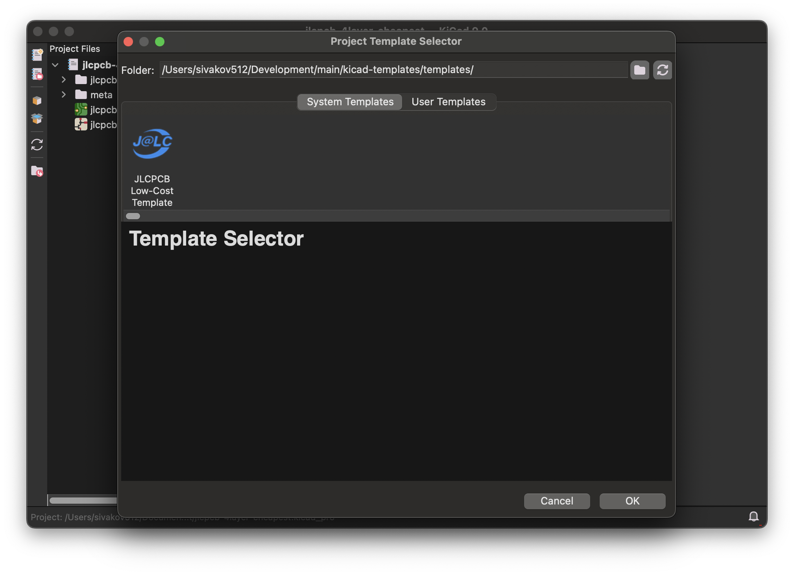

# KiCad Template Collection

A collection of KiCad PCB templates optimized for different PCB manufacturing services. Currently includes templates for JLCPCB.

Templates come with design rules and stackups already configured to meet manufacturer specifications for optimal price-to-quality ratio.

## Installation

There are two ways to install and use these templates:

### Method 1: Using Plugin and Content Manager (Recommended)

The easiest way to install these templates is through KiCad's Plugin and Content Manager:

1. Open KiCad
2. Go to **Plugin and Content Manager** → **Manage**
3. Click **Add Repository**
4. Add this repository URL:
   ```
   https://raw.githubusercontent.com/sivakov512/kicad-pcm-index/master/repository.json
   ```
5. Click **OK**
6. Find "Sivakov KiCad template collection" in the list and click **Install**
7. Restart KiCad to ensure all templates are properly loaded

To create a project using these templates after installation:

1. Go to **File** → **New Project from Template**
2. Navigate to the plugin directory:
   - On macOS: `~/Documents/KiCad/9.0/3rdparty/templates/com_github_sivakov512_kicad-templates`
   - For other operating systems, check your KiCad third-party path in **Preferences** → **Configure Paths** → **KICAD9_3RD_PARTY**
3. Select the desired template from the available options

This method ensures that your templates will automatically update when new versions are released with fixes and new templates.

### Method 2: Cloning the Repository

Alternatively, you can clone this repository and use the templates directly without using the Plugin Manager:

1. Clone this repository to your local machine
2. Go to **File** → **New Project from Template**
3. Navigate to the `kicad-templates` directory within the cloned repository
4. Select the desired template from the available options

This method makes it easier to understand the template path, but requires manual updates to get new templates and fixes.

## Available Templates

| Template | Description | Manufacturer |
|----------|-------------|--------------|
| **JLCPCB Low-Cost Template** | PCB template with minimum design rules for cost-effective fabrication at JLCPCB | JLCPCB |



## Contribution

Contributions are welcome! If you have templates for other manufacturers or different configurations, please submit a pull request.

## License

This project is licensed under the terms of the [MIT License](./LICENSE).
